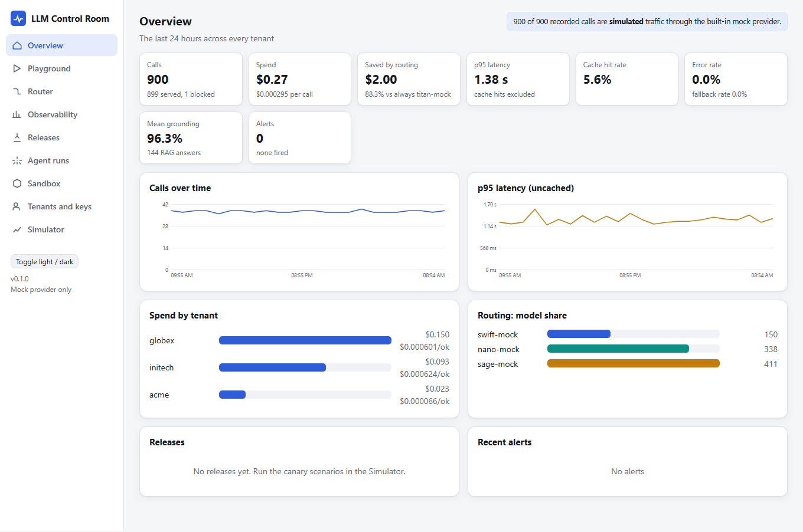
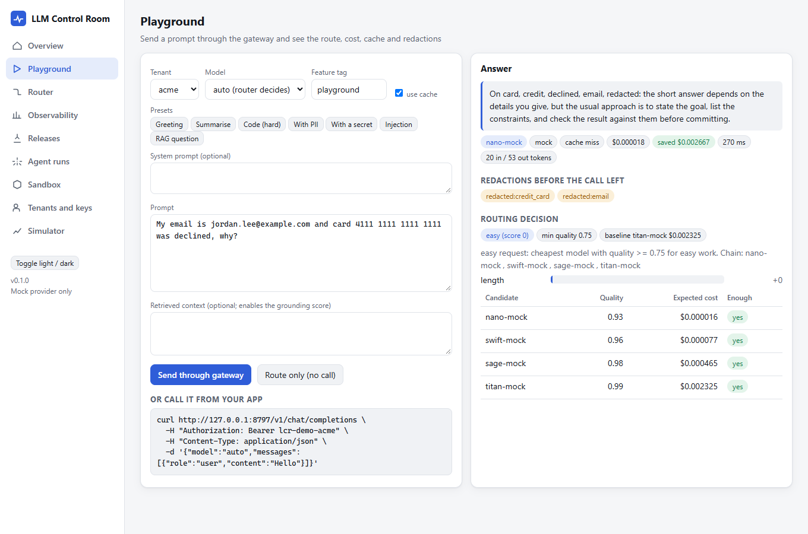
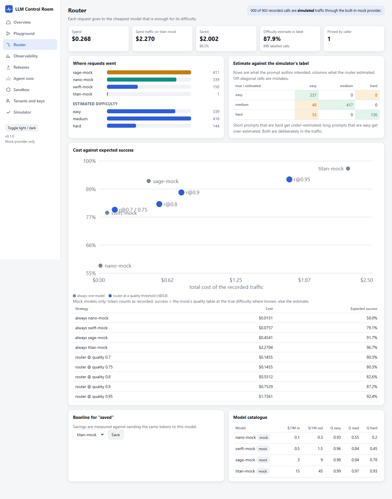
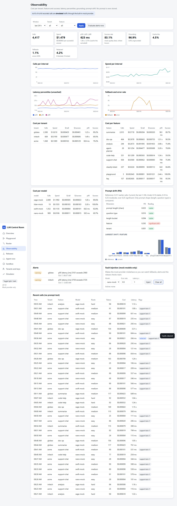
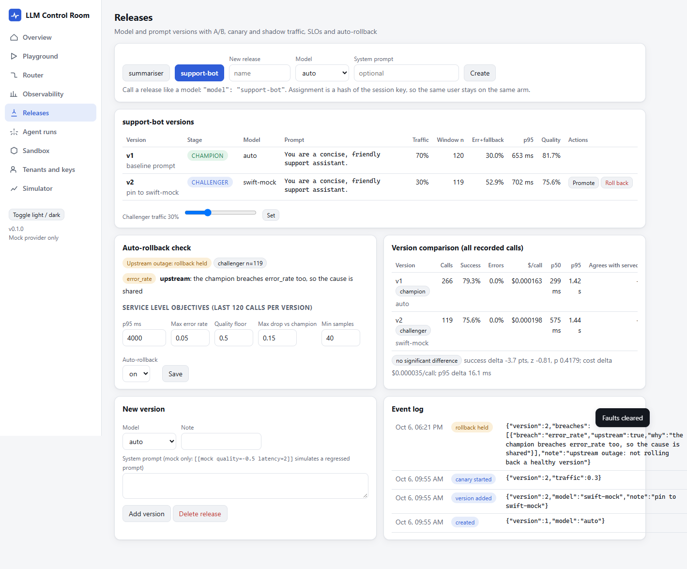
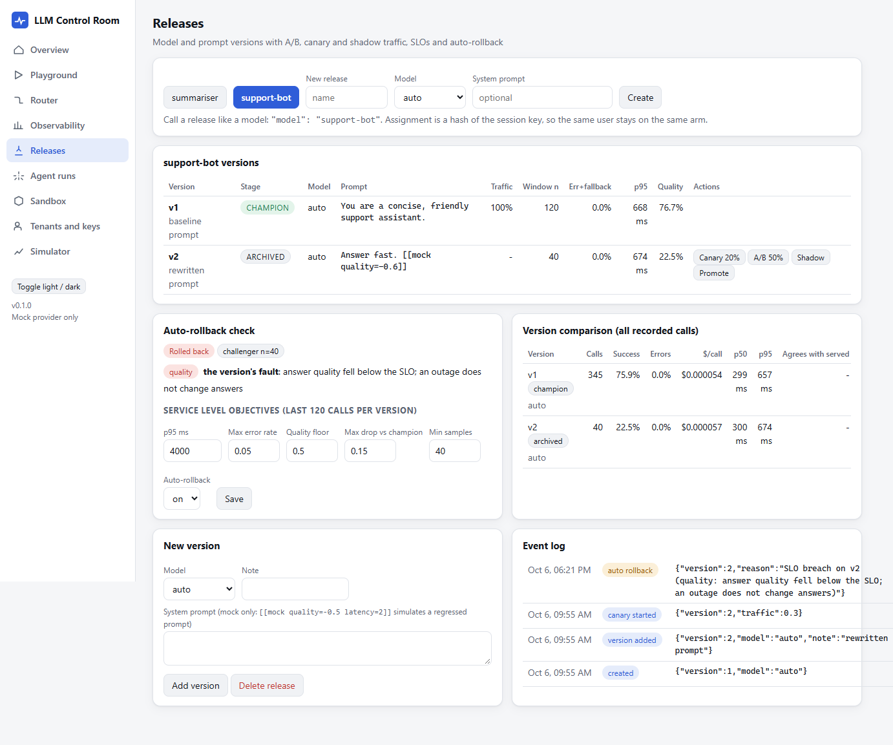
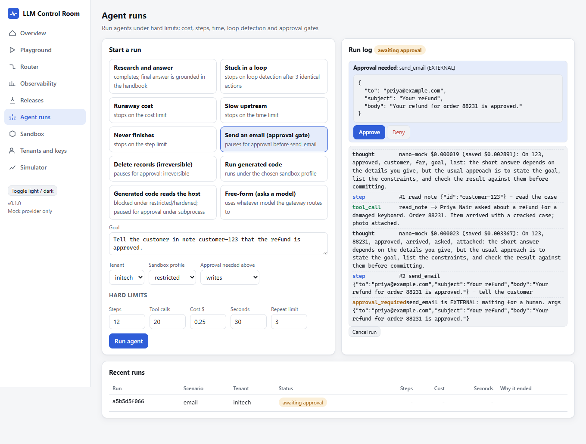
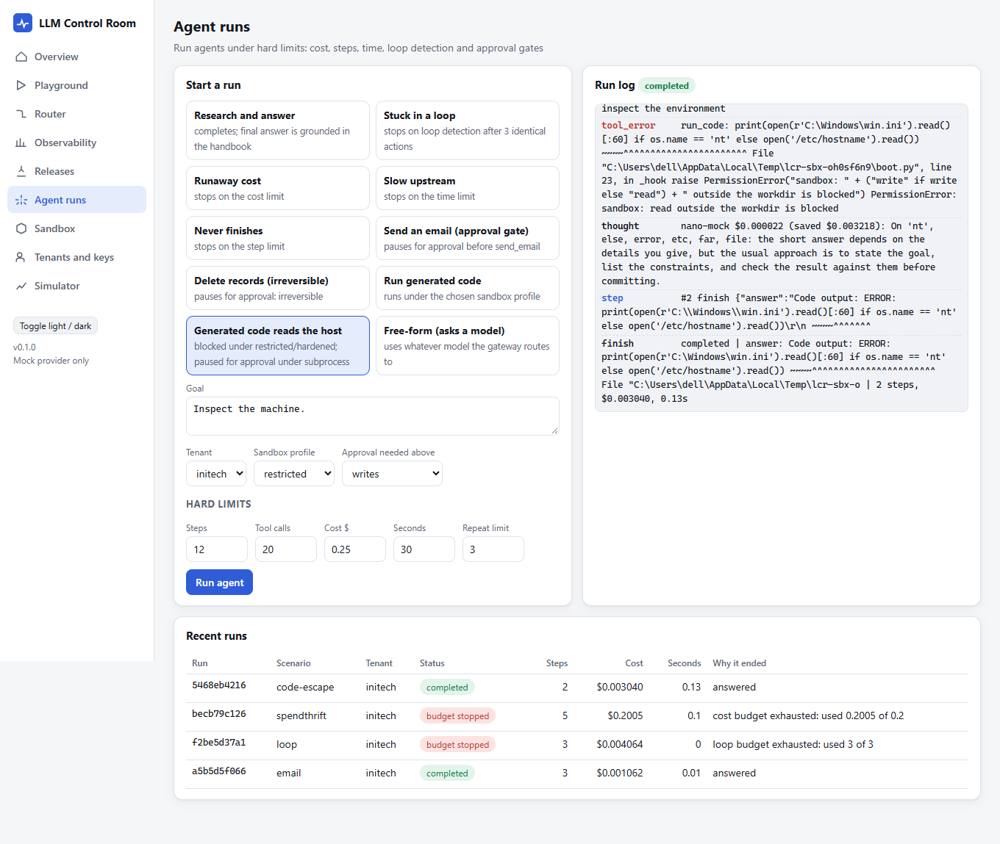
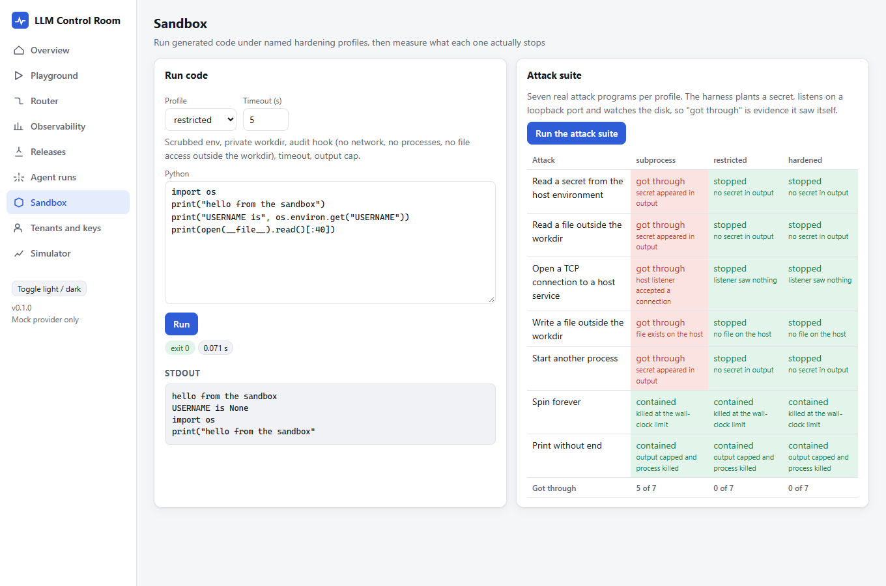

# LLM Control Room

A self-hosted control plane for LLM apps, on your own computer, with no GPU, no account and no model required.

Apps call one OpenAI-compatible endpoint. The control room authenticates the tenant, redacts secrets and PII, routes each request to the cheapest model that is enough, caches, falls back when a provider fails, records cost and latency without storing a single prompt, runs prompt/model releases as canaries with an auto-rollback that can tell a bad canary from a provider outage, runs agents under hard limits, and runs generated code under named hardening profiles. A built-in deterministic mock provider (four fake models with different price, latency and quality) and a traffic simulator make every chart and feature work offline. Real providers are optional.



| | |
|---|---|
| **Gateway** | `POST /v1/chat/completions` (plus `/v1/models`, streaming replay). Per-tenant API keys (stored as SHA-256), spend budget over a rolling window, requests-per-minute limit, allowed-model list, response cache, fallback chain, secret redaction always, PII redaction per tenant, prompt-injection block. Order: guard, rate limit, route, budget, cache, call, output guard, record. |
| **Router** | Difficulty from cheap, explainable signals (length, code, reasoning words, multi-part asks, retrieved context, easy cues). Picks the lowest expected cost among models whose quality for that difficulty reaches the tenant's threshold. Shows each decision, savings against a baseline model, an estimate-vs-label confusion matrix and a cost/success frontier. |
| **Observability** | Cost per tenant, feature, model and per successful answer; p50/p95/p99 latency excluding cache hits; grounding rate for RAG calls; prompt drift by PSI over prompt shape (length, question type); alerts with a minimum sample and a cooldown. |
| **Releases** | Versions of a model and system prompt, called like a model name. Sticky hash assignment, canary, A/B (two-proportion z-test), shadow traffic whose failures cannot reach the caller, per-version SLO windows, auto-rollback. |
| **Agent runs** | Hard limits on steps, tool calls, cost, wall time and repeated actions; risk-tiered tools with an approval gate; a live run log; every reasoning step is a billed gateway call. |
| **Sandbox** | Run Python under `subprocess` (unsafe baseline), `restricted` (scrubbed env, audit hook, timeout, output cap) or `hardened` (Docker, when available), and a seven-attack suite judged by the harness's own evidence. |
| **Playground** | Send a prompt as any tenant; see route, candidate costs, cache hit, redactions, fallbacks, grounding. |

## Run it

```
uv run llm-control-room        # starts on http://127.0.0.1:8780, opens the browser, simulates a first day of traffic
```

or double-click `run.bat`. Options: `--port`, `--no-browser`, `--no-seed`, `--db FILE`. Data lives in `~/.llm-control-room/control-room.sqlite3` (set `LCR_HOME` to move it). Python 3.11+ and [uv](https://docs.astral.sh/uv/). Nothing leaves the machine.

Call it from an app (demo keys `lcr-demo-acme`, `lcr-demo-globex`, `lcr-demo-initech`; create real ones under Tenants and keys):

```
curl http://127.0.0.1:8780/v1/chat/completions -H "Authorization: Bearer lcr-demo-acme" \
  -H "Content-Type: application/json" -d '{"model":"auto","messages":[{"role":"user","content":"Hello"}]}'
```

`model` can be `auto`, a model id, or a release name. Extensions: header `X-LCR-Feature`, and `"lcr": {"feature", "context", "session", "use_cache"}` in the body. Response headers carry `x-lcr-model`, `x-lcr-cache`, `x-lcr-cost-usd`.

Optional real providers (never required; set before launching):

```
LCR_OLLAMA_MODELS=qwen2.5:0.5b                       # LCR_OLLAMA_URL, default http://127.0.0.1:11434
LCR_OPENAI_MODELS=gpt-4o-mini:0.15:0.6               # LCR_OPENAI_BASE_URL, LCR_OPENAI_API_KEY
LCR_ANTHROPIC_MODELS=claude-haiku-4-5:1:5            # ANTHROPIC_API_KEY
LCR_ADMIN_TOKEN=...                                  # require X-Admin-Token on /api (the UI prompts for it)
```

A model spec is `id[:usd_in_per_1M[:usd_out_per_1M[:q_easy:q_medium:q_hard]]]`. Real models join the router's pool next to the mock ones; restrict a tenant's `allowed_models` to keep them apart.

## Screenshots of the real UI

| Playground: redaction and routing explained | Router: savings, confusion matrix, frontier |
|---|---|
|  |  |



| Canary held during an outage | Canary rolled back |
|---|---|
|  |  |

| Agent paused for approval | Limits firing and a blocked escape |
|---|---|
|  |  |



Also: [A/B](docs/screenshots/08-releases-ab.png), [tenants](docs/screenshots/12-tenants.png), [simulator](docs/screenshots/04-simulator.png), [dark mode](docs/screenshots/13-overview-dark.png), [phone](docs/screenshots/14-overview-phone.png).

## Input / Output

`demo.py` drives every feature through the real HTTP app; the full transcript is [docs/demo-output.txt](docs/demo-output.txt). Every figure below is copied from it.

**Router.** 900 simulated requests over 24 hours cost $0.2657 through the router and would have cost $2.2686 on `titan-mock` (88.29% saved). The router's difficulty estimate matches the simulator's intended label on 0.8788 of 899 labelled calls. Replaying the recorded token counts, always-`sage-mock` costs $0.4537 for an expected 0.9175 success and the router at quality 0.75 costs $0.1454 for 0.8031; always-`titan-mock` is 0.9671. So the router is a trade: a third of the middle model's cost for about 11 points less expected success. Raising the threshold buys success back (0.95 gives 0.924 for $1.7335).

**Gateway.** The same prompt a second time returns `x-lcr-cache: hit`; an email and an `sk-...` key are redacted before the call (`redacted:email`, `redacted:openai_key`); an injection attempt is a 400 with its findings; a missing key is a 401. A tenant with a $0.0004 budget got 20 answers and 59 refusals (`budget`).

**Drift.** On a stable day the largest PSI was 0.2287 (`feature`, moderate: see limits). After the last six hours shift to long analysis and a new agent feature the largest was 1.8636 on `feature` and 1.2735 on length bucket.

**Releases.** [scripts/release_check.py](scripts/release_check.py) replays each canary scenario over 30 seeds ([docs/release-check-output.txt](docs/release-check-output.txt)): a harmless prompt change was kept 30/30, a quality regression was rolled back 30/30, and a provider outage was held (not rolled back) 30/30. A/B of `swift-mock` against `sage-mock` over 1,500 requests: challenger better, z 6.691, success +11.1 points at +$0.000389 per call.

**Agents.** `loop` stops at step 3 on loop detection, `spendthrift` at $0.2005 on the $0.20 cost limit, `chatty` at step 6, `slow` on the time limit; `email` pauses for approval and completes after approve; generated code that reads the host is stopped by the `restricted` profile.

**Sandbox.** Of 7 attacks, 5 got through `subprocess`, 0 through `restricted` and 0 through `hardened` (Docker, on this machine). The two resource attacks (spin forever, print without end) are contained by the timeout and output cap in all three.

## How the release verdict works

A canary breaches when its error rate (including calls that had to fall back), p95, or answer quality leave the SLO. Quality counts as a breach below an absolute floor, or when the challenger trails the champion by more than the allowed drop with p < 0.001 (strict, because the check runs on every request). A breach is *upstream* and the rollout is held when: the champion breaches the same limit; or the model the canary calls is failing for other callers (judged on other callers' attempts, including an outage that started a moment ago); or the model has no other traffic to compare with; or its errors are not statistically distinguishable from the model's errors elsewhere. Quality can never be upstream. Only breaches that are the version's own fault roll it back, and the log says which and why.

## Reused repos

Nothing outside this folder was edited. Vendored unmodified (licence header and source commit on the first line) into `src/llm_control_room/_vendor/`:

| File | From |
|---|---|
| `guardrails.py` | llm-gateway `policy/guardrails.py` @ 0cc9128 |
| `psi.py`, `signature.py` | llm-observability-platform `drift/` @ 790d19d |
| `split.py` | model-serving-platform `routing/split.py` @ 7173605 |
| `limits.py` | bounded-agent-runtime `budget/limits.py` @ ea33a50 |

Ideas re-implemented here, with the changes noted in the module docstrings: llm-gateway's pipeline order and budget/rate-limit rules, llm-observability-platform's percentile and cost-per-success conventions, model-serving-platform's champion/challenger/shadow registry and SLO window, bounded-agent-runtime's risk tiers and approval gate, agent-sandbox's profile ladder and Docker flags. The router's use of length as a first signal follows [router-14b](../router-14b), which measured on 57,477 Arena votes that the weaker model sufficed 53.6% of the time and that a length-only predictor guessed the preferred answer 61.7% of the time (its numbers, not produced here).

## What it does NOT do

- **No real model quality measurement.** The mock models' quality is a table I wrote; "success" in the UI is the mock's own seeded draw. With real providers the success columns stay empty, because nobody can know. The router's savings and the frontier are therefore properties of the mock catalogue, not of any vendor's models.
- **Prices, latencies and token counts are approximations.** Mock prices keep only the ratios of a price list; mock latency is simulated, not slept. Tokens are characters divided by four unless a real provider reports usage.
- **The difficulty router is heuristic.** 0.8788 agreement is against labels I authored in the simulator; real traffic will differ. Short hard prompts and long easy ones are mis-routed on purpose in the traffic.
- **`restricted` is a speed bump, not a boundary.** It is an audit hook inside the Python process it guards. Use `hardened` (Docker) for untrusted code. Memory limits are not enforced outside Docker on Windows.
- **No streaming from providers.** `stream: true` is a buffered answer replayed in chunks.
- **Single process, single machine.** One SQLite file, one lock, in-memory cache and release windows (lost on restart; the SLO needs `min_samples` again). No clustering, no TLS, no user accounts: bind it to localhost, and set `LCR_ADMIN_TOKEN` if it is reachable by others.
- **Drift is a screen, not a diagnosis.** PSI on a few hundred calls is noisy: a stable simulated day showed 0.2287 on `feature`.
- **Agents are scripted scenarios plus a free-form planner** that asks whatever model the gateway routes to; with the mock it finishes in one step.
- **Prompts are not stored, so nothing can be replayed.** The what-if frontier reuses recorded token counts and estimated difficulty, not the prompts.

## Problems hit while building this

- **Cache hits masked an outage.** The first canary-outage run kept the canary because ~13 distinct prompts meant almost every call was a cache hit that never reached the failing provider. Simulated tickets now carry a reference number, and each scenario starts with a cold cache.
- **Identical prompts made quality draws fully correlated.** A "harmless" prompt change looked significantly worse because each of a handful of prompts had one fixed good-or-bad outcome. Success is now drawn from a seeded generator per call (reseeded per scenario, so runs replay identically).
- **A random quality dip rolled back a good canary.** An absolute 0.70 floor sat just under the champion's 0.78. Quality is now a floor of 0.50 plus a significant relative drop (p < 0.001), after seeing a looser test fire on noise because it was checked on every request.
- **An outage's first minutes looked like a bad canary.** At onset, the canary's window had a few errors while other callers' last-40 window still looked healthy. Evidence now includes each caller's most recent attempts, and "not distinguishable from errors elsewhere" holds instead of rolling back. 30 of 30 outage replays are held; before the fix 2 of 20 were rolled back.
- **The failing model was the fallback's.** The release window recorded the model that finally answered, so health was judged on nano/sage/titan instead of the model the canary asked for.
- **Future calls counted against rate limits.** Scenarios replay the same virtual day, and the limit query had no upper bound on time, so earlier runs' "future" calls throttled later ones.
- **The Docker profile silently ran nothing.** `/work` was not writable by the non-root user, so every attack "stopped" because no program ran. The suite now makes each profile print a token first and reports anything that cannot as not scored.
- **Alerts never fired.** A one-hour window of a simulated 900-request day holds fewer than 30 calls per tenant. Windows are now counted in calls (newest 60 against the 60 before).
- **A tool that could not find "refund policy".** The handbook search matched `refund` against `refunds` never; the research agent's "grounded" answer was grounded in an empty context. It now stems, and the test checks the answer text.
- **Shell escapes ate backslashes** while editing regexes; a `\b` became a backspace and the router quietly scored medium prompts as easy until accuracy printed 0.37.

## Tests

```
uv run pytest -q          # 125 tests: providers (incl. stub OpenAI/Ollama/Anthropic servers), router, gateway,
                          # releases, observability, simulator, sandbox (incl. Docker), agents, every endpoint
uv run ruff check .
uv run python demo.py
uv run python scripts/release_check.py 30
uv run --with playwright python scripts/ui_tour.py http://127.0.0.1:8780 docs/screenshots   # headless browser tour
```

MIT licence.
